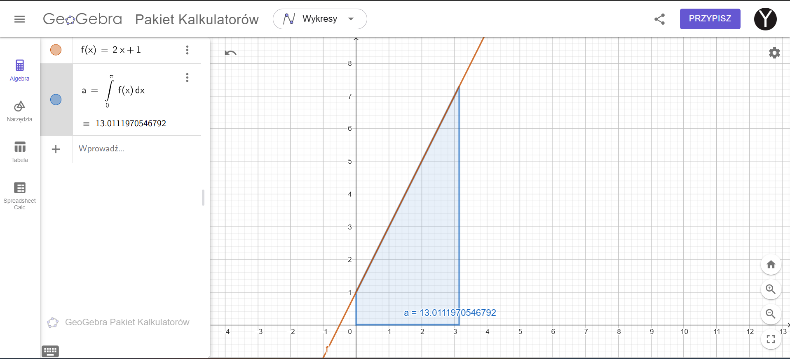
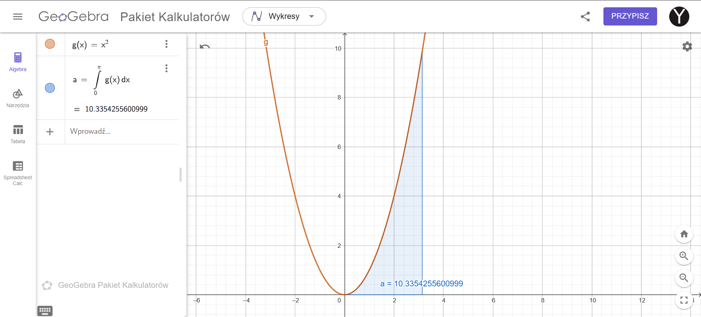
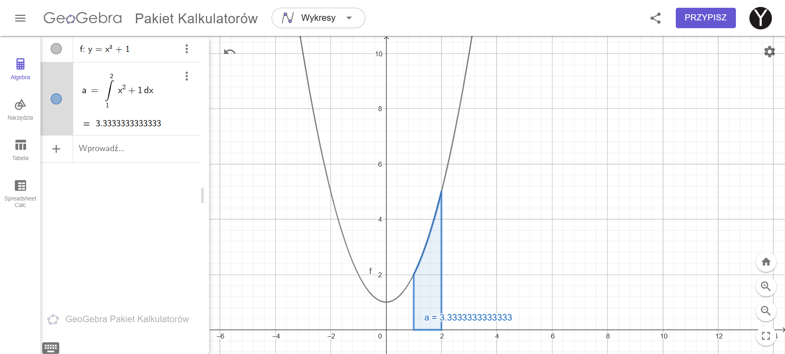
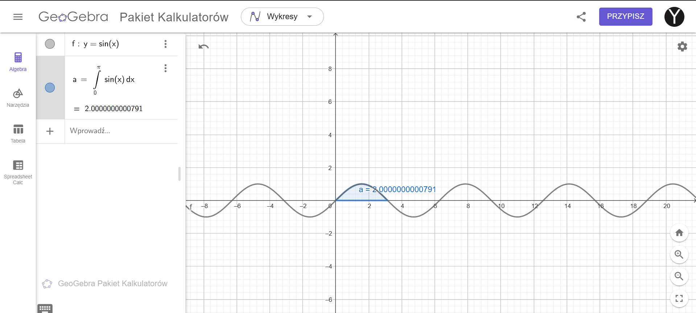
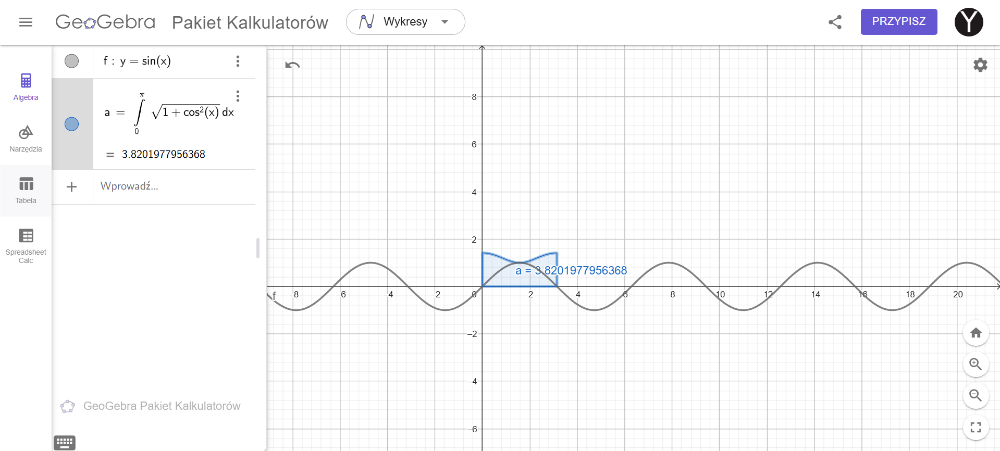

## Integrals

1. Compute:
   - $\int 1 dx$
   - $\int (x^2 +2) dx$
   - $\int 2\sin(x) dx$
   - $\int \frac{3}{x} dx$
   - $\int \frac{1}{x^2} dx$
   - $\int \left( \frac{1}{3}x^4 - 5 \right) \, dx$
   - $\int (\sin^2 x + \cos^2 x) \, dx$
   - $\int (5 \sin x + 3e^x) \, dx$
   - $\int \sqrt[3]{x} \, dx$
   - $\int \sqrt{10x} \, dx$
   - $\int \cos\left(\frac{5}{2}x + 3\right) \, dx$
   - $\int \frac{\cos(\ln(x))}{x} \, dx$
   - $\int x \ln(x) \, dx$
   - $\int x e^x \, dx$

2. Calculate integrals over the interval $[0, \pi]$ and visualize them in Geogebra:
   - $f(x)=2x+1$
   - $g(x)=x^2$

3. Calculate the area of the region bounded by the lines:
$x = 1$, $x = 2$, $y = 0$, and $y = x^2 + 1$. Show it in Geogebra.

4. Calculate the area under the sine curve over the interval $[0, \pi]$, using:

$$P = \int_a^b f(x) \, dx = \int_0^\pi \sin(x) \, dx$$

5. Calculate the length of the sine curve over the same interval using:

$$L = \int_a^b \sqrt{1 + (f'(x))^2} \, dx= \int_0^\pi \sqrt{1 + \cos^2(x)} \, dx
$$ 

6. Find the distance of the moving particle between time $t=0$ and $t=2$ for the following position function: $x(t) = 3t^2 - 6t + 1$.

##
---
***№1***

1. **Całka z 1 względem $x$:** (Интеграл от 1 по $x$:)
   $$
   \int 1 \, dx = x + C
   $$

2. **Całka z $x^2 + 2$ względem $x$:** (Интеграл от $x^2 + 2$ по $x$:)
   $$
   \int (x^2 + 2) \, dx = \frac{x^3}{3} + 2x + C
   $$

3. **Całka z $2\sin(x)$ względem $x$:** (Интеграл от $2\sin(x)$ по $x$:)
   $$
   \int 2\sin(x) \, dx = -2\cos(x) + C
   $$

4. **Całka z $\frac{3}{x}$ względem $x$:** (Интеграл от $\frac{3}{x}$ по $x$:)
   $$
   \int \frac{3}{x} \, dx = 3 \ln |x| + C
   $$

5. **Całka z $\frac{1}{x^2}$ względem $x$ (również zapisywane jako $x^{-2}$):** (Интеграл от $\frac{1}{x^2}$ по $x$ (также записывается как $x^{-2}$):)
   $$
   \int \frac{1}{x^2} \, dx = \int x^{-2} \, dx = -\frac{1}{x} + C
   $$

6. **Całka z $\frac{1}{3}x^4 - 5$ względem $x$:** (Интеграл от $\frac{1}{3}x^4 - 5$ по $x$:)
   $$
   \int \left( \frac{1}{3}x^4 - 5 \right) \, dx = \frac{1}{3} \cdot \frac{x^5}{5} - 5x + C = \frac{x^5}{15} - 5x + C
   $$

7. **Całka z $\sin^2(x) + \cos^2(x)$ względem $x$:** (Интеграл от $\sin^2(x) + \cos^2(x)$ по $x$:)
   $$
   \int (\sin^2(x) + \cos^2(x)) \, dx = \int 1 \, dx = x + C
   $$
   (Ponieważ $\sin^2(x) + \cos^2(x) = 1$.) (Поскольку $\sin^2(x) + \cos^2(x) = 1$.)

8. **Całka z $5\sin(x) + 3e^x$ względem $x$:** (Интеграл от $5\sin(x) + 3e^x$ по $x$:)
   $$
   \int (5\sin(x) + 3e^x) \, dx = -5\cos(x) + 3e^x + C
   $$

9. **Całka z $\sqrt[3]{x}$ względem $x$ (również zapisywane jako $x^{1/3}$):** (Интеграл от $\sqrt[3]{x}$ по $x$ (также записывается как $x^{1/3}$):)
   $$
   \int \sqrt[3]{x} \, dx = \int x^{1/3} \, dx = \frac{x^{4/3}}{4/3} + C = \frac{3}{4}x^{4/3} + C
   $$

10. **Całka z $\sqrt{10x}$ względem $x$ (zapisywane jako $(10x)^{1/2}$):** (Интеграл от $\sqrt{10x}$ по $x$ (записывается как $(10x)^{1/2}$):)
    $$
    \int \sqrt{10x} \, dx = \int (10x)^{1/2} \, dx = \frac{2}{3}(10x)^{3/2} \cdot \frac{1}{10^{1/2}} + C = \frac{2}{3} \cdot 10^{1/2} x^{3/2} + C
    $$

11. **Całka z $\cos\left(\frac{5}{2}x + 3\right)$ względem $x$:** (Интеграл от $\cos\left(\frac{5}{2}x + 3\right)$ по $x$:)
    $$
    \int \cos\left(\frac{5}{2}x + 3\right) \, dx = \frac{2}{5}\sin\left(\frac{5}{2}x + 3\right) + C
    $$

12. **Całka z $\frac{\cos(\ln(x))}{x}$ względem $x$:** (Интеграл от $\frac{\cos(\ln(x))}{x}$ по $x$:)
    $$
    \int \frac{\cos(\ln(x))}{x} \, dx = \sin(\ln(x)) + C
    $$

13. **Całka z $x \ln(x)$ względem $x$:** (Интеграл от $x \ln(x)$ по $x$:)
    $$
    \int x \ln(x) \, dx = \frac{x^2}{2}\ln(x) - \frac{x^2}{4} + C
    $$
    (Wykorzystując całkowanie przez części, $u = \ln(x)$, $dv = x \, dx$.) (Используя интегрирование по частям, $u = \ln(x)$, $dv = x \, dx$.)

14. **Całka z $x e^x$ względem $x$:** (Интеграл от $x e^x$ по $x$:)
    $$
    \int x e^x \, dx = (x - 1)e^x + C
    $$
    (Wykorzystując całkowanie przez części, $u = x$, $dv = e^x \, dx$.) (Используя интегрирование по частям, $u = x$, $dv = e^x \, dx$.)
---
---
***№2***

### Obliczanie całki (Вычисление интеграла)

1. **Zadanie całkowania:**
   $$
   \int_0^\pi (2x + 1) \, dx
   $$

2. **Rozwiązanie:**
   - Znajdź całkę nieoznaczoną:
     $$
     \int (2x + 1) \, dx = x^2 + x + C
     $$
   - Podstaw granice całkowania:
     $$
     \left[ x^2 + x \right]_0^\pi = (\pi^2 + \pi) - (0^2 + 0) = \pi^2 + \pi
     $$
   - Zatem, wartość całki funkcji $ f(x) = 2x + 1 $ w przedziale od 0 do $\pi$ wynosi $\pi^2 + \pi$.

### Obliczanie całki (Вычисление интеграла)

1. **Zadanie całkowania:**
   $$
   \int_0^\pi x^2 \, dx
   $$

2. **Rozwiązanie:**
   - Znajdź całkę nieoznaczoną:
     $$
     \int x^2 \, dx = \frac{x^3}{3} + C
     $$
   - Podstaw granice całkowania:
     $$
     \left[ \frac{x^3}{3} \right]_0^\pi = \frac{\pi^3}{3} - \frac{0^3}{3} = \frac{\pi^3}{3}
     $$
   - Zatem, wartość całki funkcji $ g(x) = x^2 $ w przedziale od 0 do $\pi$ wynosi $\frac{\pi^3}{3}$.

##
---
***№3***
### Obliczanie całki (Вычисление интеграла)

1. **Zadanie całkowania:**
   $$
   \int_{1}^{2} (x^2 + 1) \, dx
   $$

2. **Rozwiązanie:**
   - Znajdź całkę nieoznaczoną:
     $$
     \int (x^2 + 1) \, dx = \frac{x^3}{3} + x + C
     $$
   - Podstaw granice całkowania:
     $$
     \left[ \frac{x^3}{3} + x \right]_1^2 = \left(\frac{2^3}{3} + 2\right) - \left(\frac{1^3}{3} + 1\right)
     $$
     $$
     = \frac{8}{3} + 2 - \frac{1}{3} - 1 = \frac{7}{3} + 1 = \frac{7}{3} + \frac{3}{3} = \frac{10}{3}
     $$
   - Zatem, wartość całki funkcji \( g(x) = x^2 \) w przedziale od 0 do \(\pi\) wynosi \(\frac{\pi^3}{3}\). (Итак, площадь ограниченной области равна $\frac{10}{3}$ квадратных единиц.)

##
---
***№4***

### Obliczanie całki (Вычисление интеграла)

1. **Zadanie całkowania:**
   $$
   P = \int_0^\pi \sin(x) \, dx
   $$

2. **Obliczanie całki:**
   - Znajdź pierwotną funkcji $ \sin(x) $. Pierwotna dla $ \sin(x) $ to $ -\cos(x) $. Następnie oblicz całkę oznaczoną:
   $$
   \int_0^\pi \sin(x) \, dx = [-\cos(x)]_0^\pi = -\cos(\pi) - (-\cos(0)) = -(-1) - (-1) = 2
   $$
   - W rezultacie wartość całki równa się 2, co jest równoważne powierzchni pod krzywą sinus od 0 do $\pi$. (В результате, значение интеграла равно 2, что и является площадью под кривой синуса от 0 до $\pi$.)

##
---
***№5***

### Obliczanie długości łuku (Вычисление длины дуги)

1. **Funkcja i jej pochodna:**
   Funkcja $f(x) = \sin(x)$ ma pochodną $f'(x) = \cos(x)$ (Функция $f(x) = \sin(x)$ имеет производную $f'(x) = \cos(x)$).

2. **Podstawienie do wzoru na długość łuku:**
   Podstawiamy pochodną do wzoru na długość łuku:
   $$
   L = \int_0^\pi \sqrt{1 + \cos^2(x)} \, dx
   $$

3. **Obliczanie całki:**
   Całka $\int_0^\pi \sqrt{1 + \cos^2(x)} \, dx$ nie wyraża się w funkcjach elementarnych i wymaga numerycznego rozwiązania lub użycia specjalistycznych programów matematycznych do dokładnego wyniku. (Интеграл $\int_0^\pi \sqrt{1 + \cos^2(x)} \, dx$ не выражается в элементарных функциях и требует численного решения или использования специализированных математических программ для точного результата).

   

##
---
***№6***

### Obliczanie długości toru ruchu cząstki (Вычисление длины траектории движущейся частицы)

1. **Funkcja położenia i jej pochodna:**
   Funkcja położenia jest określona jako:
   $$
   x(t) = 3t^2 - 6t + 1
   $$
   Pochodna funkcji położenia, która reprezentuje prędkość cząstki:
   $$
   v(t) = x'(t) = \frac{d}{dt}(3t^2 - 6t + 1) = 6t - 6
   $$

2. **Obliczenie wartości bezwzględnej prędkości:**
   Wartość bezwzględna prędkości jest potrzebna do określenia faktycznego przebytego dystansu:
   $$
   |v(t)| = |6t - 6|
   $$

3. **Obliczanie całki z wartości bezwzględnej prędkości:**
   Aby obliczyć całkowity dystans przebyty przez cząstkę, używamy całki z wartości bezwzględnej prędkości w przedziale od 0 do 2:
   $$
   \text{Dystans} = \int_0^2 |6t - 6| \, dt
   $$
   Pochodna zmienia znak na \( t = 1 \). Dlatego całka jest dzielona na dwa przedziały:
   $$
   \int_0^1 (6 - 6t) \, dt \quad \text{i} \quad \int_1^2 (6t - 6) \, dt
   $$

4. **Obliczanie całek na każdym przedziale:**
   $$
   \int_0^1 (6 - 6t) \, dt = [6t - 3t^2]_0^1 = 3
   $$
   $$
   \int_1^2 (6t - 6) \, dt = [3t^2 - 6t]_1^2 = 3
   $$

5. **Całkowity dystans:**
   Sumując wyniki całek, otrzymujemy:
   $$
   \text{Całkowity dystans} = 3 + 3 = 6 \text{jednostek} (Общее расстояние = 3 + 3 = 6 \text{ единиц})

