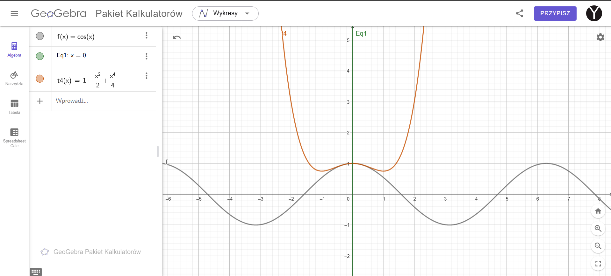
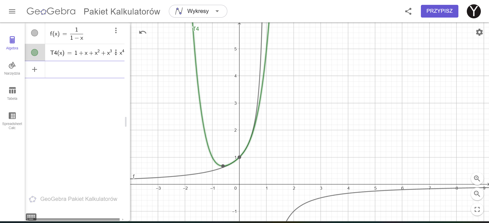
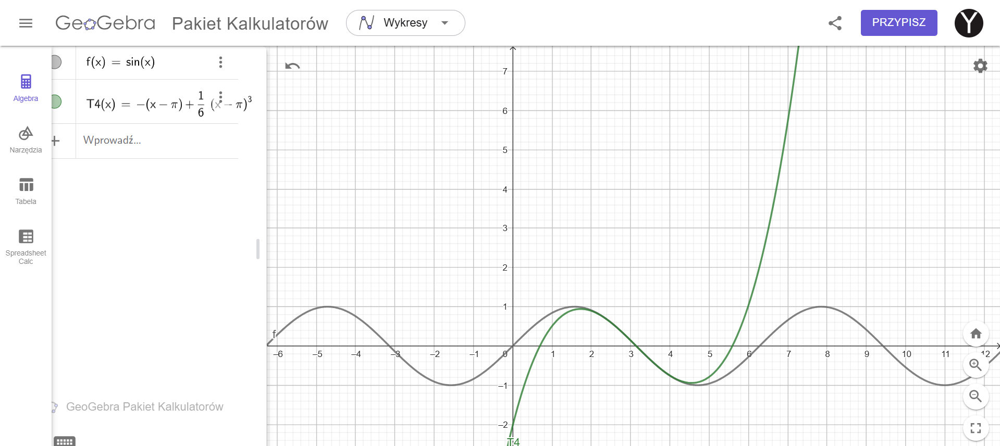

Find the Taylor series and visualize obtained functions in Geogebra:
   - $f(x) = \cos(x)$ around $x = 0$ up to the 4th degree.
   - $h(x) = 1/(1-x)$ around $x = 0$ up to the 4rd degree.
   - $g(x) = \sin(x)$ around $x = \pi$ up to the 4rd degree.

***№1***

   Aby uzyskać szereg Taylora dla funkcji $f(x) = \cos(x)$ w otoczeniu $x = 0$ do czwartego stopnia włącznie (Чтобы получить ряд Тейлора для функции $f(x) = \cos(x)$ в окрестности $x = 0$ до четвертого порядка включительно), zaczynamy od obliczenia pochodnych funkcji $\cos(x)$ i ich wartości w punkcie $x = 0$ (начинаем с вычисления производных функции $\cos(x)$ и их значений в точке $x = 0$):

1. $f(x) = \cos(x)$  
   $f(0) = \cos(0) = 1$ (первая функция, значение в нуле равно 1)

2. $f'(x) = -\sin(x)$  
   $f'(0) = -\sin(0) = 0$ (первая производная, значение в нуле равно 0)

3. $f''(x) = -\cos(x)$  
   $f''(0) = -\cos(0) = -1$ (вторая производная, значение в нуле равно -1)

4. $f'''(x) = \sin(x)$  
   $f'''(0) = \sin(0) = 0$ (третья производная, значение в нуле равно 0)

5. $f''''(x) = \cos(x)$  
   $f''''(0) = \cos(0) = 1$ (четвертая производная, значение в нуле равно 1)

Szereg Taylora dla funkcji $f(x)$ w otoczeniu punktu $x = a$ jest dany wzorem (Ряд Тейлора для функции $f(x)$ в окрестности точки $x = a$ задается формулой):

$$
T(x) = \sum_{n=0}^\infty \frac{f^{(n)}(a)}{n!}(x-a)^n
$$

Podstawiając uzyskane pochodne, szereg Taylora dla $\cos(x)$ w otoczeniu $x = 0$ do czwartego stopnia prezentuje się następująco (Подставляя полученные производные, ряд Тейлора для $\cos(x)$ в окрестности $x = 0$ до четвертого порядка выглядит следующим образом):

$$
T_4(x) = 1 - \frac{x^2}{2!} + \frac{x^4}{4!}
$$

$$
T_4(x) = 1 - \frac{x^2}{2} + \frac{x^4}{24}
$$

---

***№2***
Aby uzyskać szereg Taylora dla funkcji $h(x) = \frac{1}{1-x}$ w otoczeniu $x = 0$ do czwartego stopnia włącznie (Чтобы получить ряд Тейлора для функции $h(x) = \frac{1}{1-x}$ в окрестности $x = 0$ до четвертого порядка включительно), obliczamy pochodne funkcji w punkcie $x = 0$ i wykorzystujemy je do stworzenia szeregu Taylora:

1. **Funkcja:**
   $$ h(x) = \frac{1}{1-x} $$

2. **Pierwsza pochodna:**
   $$ h'(x) = \frac{1}{(1-x)^2} $$
   $$ h'(0) = 1 $$

3. **Druga pochodna:**
   $$ h''(x) = \frac{2}{(1-x)^3} $$
   $$ h''(0) = 2 $$

4. **Trzecia pochodna:**
   $$ h'''(x) = \frac{6}{(1-x)^4} $$
   $$ h'''(0) = 6 $$

5. **Czwarta pochodna:**
   $$ h''''(x) = \frac{24}{(1-x)^5} $$
   $$ h''''(0) = 24 $$

### Wzór szeregu Taylora

Szereg Taylora funkcji $f(x)$ wokół punktu $x = a$ jest dany wzorem:
$$
T(x) = \sum_{n=0}^\infty \frac{f^{(n)}(a)}{n!}(x-a)^n
$$

### Stosując wzór

Korzystając z obliczonych pochodnych:
$$
T_4(x) = 1 + x + \frac{2}{2!}x^2 + \frac{6}{3!}x^3 + \frac{24}{4!}x^4
$$
$$
T_4(x) = 1 + x + x^2 + x^3 + x^4
$$

---

***№3***

Aby uzyskać szereg Taylora dla funkcji $g(x) = \sin(x)$ w otoczeniu $x = \pi$ do czwartego stopnia włącznie (Чтобы получить ряд Тейлора для функции $g(x) = \sin(x)$ в окрестности $x = \pi$ до четвертого порядка включительно), obliczamy pochodne funkcji w punkcie $x = \pi$ i wykorzystujemy je do stworzenia szeregu Taylora:

1. **Funkcja:**
   $$ g(x) = \sin(x) $$
   $$ g(\pi) = \sin(\pi) = 0 $$

2. **Pierwsza pochodna:**
   $$ g'(x) = \cos(x) $$
   $$ g'(\pi) = \cos(\pi) = -1 $$

3. **Druga pochodna:**
   $$ g''(x) = -\sin(x) $$
   $$ g''(\pi) = -\sin(\pi) = 0 $$

4. **Trzecia pochodna:**
   $$ g'''(x) = -\cos(x) $$
   $$ g'''(\pi) = -\cos(\pi) = 1 $$

5. **Czwarta pochodna:**
   $$ g''''(x) = \sin(x) $$
   $$ g''''(\pi) = \sin(\pi) = 0 $$

### Wzór szeregu Taylora

Szereg Taylora funkcji $f(x)$ wokół punktu $x = a$ jest dany wzorem:
$$
T(x) = \sum_{n=0}^\infty \frac{f^{(n)}(a)}{n!}(x-a)^n
$$

### Stosując wzór

Korzystając z obliczonych pochodnych:
$$
T_4(x) = g(\pi) + g'(\pi)(x-\pi) + \frac{g''(\pi)}{2!}(x-\pi)^2 + \frac{g'''(\pi)}{3!}(x-\pi)^3 + \frac{g''''(\pi)}{4!}(x-\pi)^4
$$
$$
T_4(x) = 0 - 1(x-\pi) + 0 + \frac{1}{6}(x-\pi)^3 + 0
$$
$$
T_4(x) = -(x-\pi) + \frac{1}{6}(x-\pi)^3
$$

